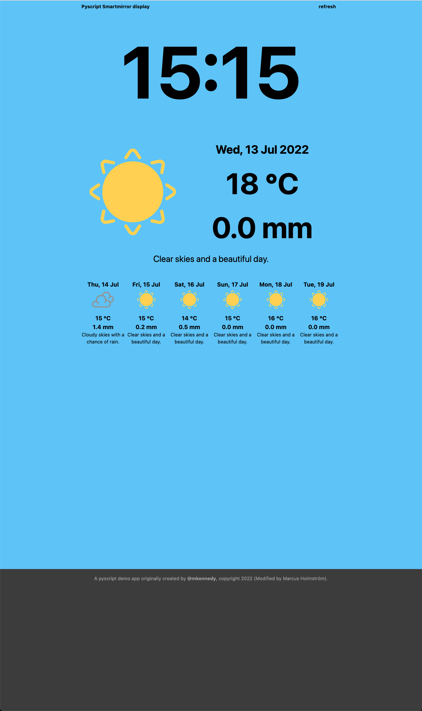

# pyscript PWA Example (Original readme)

This app shows how using a PWA (Progressive Web App) along with [pyscript](https://pyscript.net)
allows us to create Python-based web applications that install like regular applications and
(mostly) don't suffer from the large file downloads needed for Python's WebAssembly runtime.



To run the app, just start it as a Flask application (keep the app running for the web weather API).

```bash

python3 -m venv venv
source ./venv/bin/activate
pip install -r requirements.txt
flask run

```

Then open 127.0.0.1:5000 and choose "install PWA". See 
[these steps for Chrome](https://www.howtogeek.com/fyi/how-to-install-progressive-web-apps-pwas-in-chrome/), 
google the actions if you are new to this in your browser.

Unfortunately, Mozilla gave up on this feature for Firefox browser.

If you have improvements for the PWA side of things, please open a PR. It's very bare-bones.

# Smartmirror display

This app has been extended with the purpose to run on a smart mirror display. 

## Current features
- Display time
- Weather app
    - Color theame based on weather conditions
    - Real time weather (From SMHI (Sveriges meteorologiska och hydrologiska institut))
    - Caching weather data
- Refresh button

## Comming features
- Display time
    - Autoupdate the time
- Weather app
    - Position (Lon Lat) detection
- Calendar app
- Commute app (train/buss schedule)
- Raspberry pi friendly runtime
    - Some kind of on/off automation